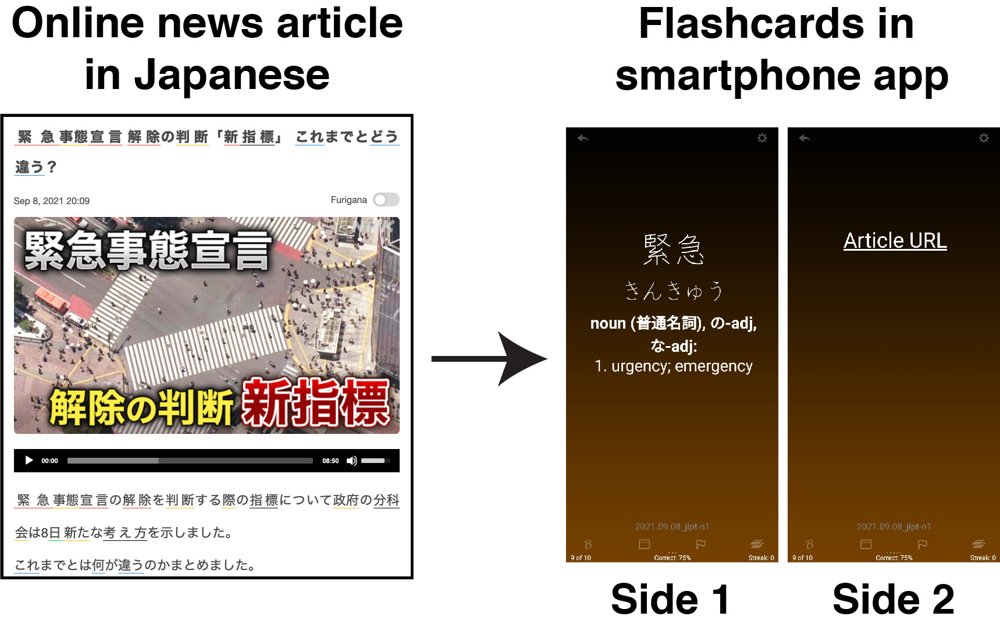

# Japanese News Article Flashcard Generator

## Repository description:
* A group of functions that allow for web-scraping of Japanese online news articles in order to study 
vocabulary for the Japanese Language Proficiency Test (JLPT).
* The script uses [Beautiful Soup](https://www.crummy.com/software/BeautifulSoup/) to scrape information from the appropriate HTML
tags and organises the vocabulary into dictionaries with the corresponding JLPT level
as the keys. Then information from the [WWWJDIC](http://nihongo.monash.edu/cgi-bin/wwwjdic) is used to find the matching
English definition, and the information is exported as a Microsoft Excel file using Pandas in a 
format that can be imported into the smartphone app [Flashcards Deluxe](http://orangeorapple.com/Flashcards/) to make flashcards.
* Currently, the functions work with the [Easy Japanese News](http://easyjapanese.net/) website,
but I have plans in the future to add functions compatible with other popular Japanese
news sites such as [Yahoo](https://news.yahoo.co.jp/) and [Mainichi](https://mainichi.jp/).
